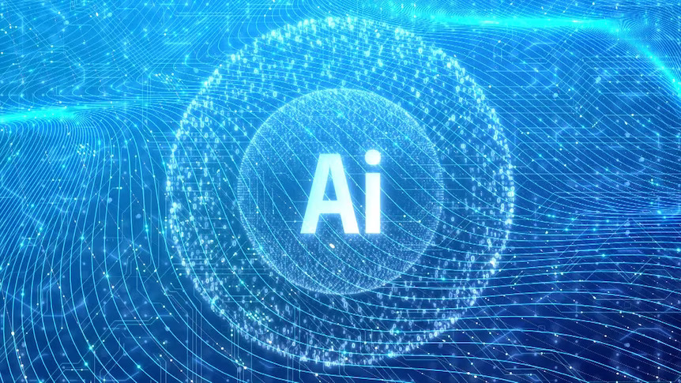

  

## I. Introduction
AI is becoming increasingly integrated into education, and within the domain of Software Engineering, serving as both a mentor and a driver of innovation. In the ICS 314 course, I've used ChatGPT to assist me in identifying issues in my code that I might have not seen.

### II. Personal Experience with AI:
I have used AI in class this semester in the following areas:

1. Experience WODs e.g. E18
I chose not to use any of the  AI tools  for the WODs and instead used what we were learning to understand the basics of the specified area. When I faced challenges, I used the resources from the course and looked at documentation to help me understand and finish the tasks.

2.In-class Practice WODs
I practiced WODs to improve my problem-solving skills in a limited time. As they weren't graded, I turned to AI for assistance and guidance on tasks I had forgotten how to do.

3.In-class WODs
After practicing with experience and in-class WODs, I felt prepared for the actual in-class WODs. During one of the in class WODS,I utilized ChatGPT. It helped me with finding where my mistake was.

4.Essays 
I didn't use AI to compose essays but utilized ChatGPT to help with my grammar. However, there were times where ChatGPT didn’t sound human, so I had to seek help from friends.

5.Final project
Using AI in the final project was tough. The project had lots of file to look a.  was complicated with lots of connected parts, so ChatGPT didn't work well. I had to copy and paste many code files, which was slow and hard. I discovered it was more effective to review the code myself and rely on my teammates for assistance.

6.Learning a concept / tutorial 
When I learn new concepts, I prefer to look at modules or watch YouTube videos. They give me more detailed answers compared to AI, which usually gives a general overview based on the prompt. Sometimes, using AI is challenging because I don't always know what to ask.

7.Answering a question in class or in Discord 
Seeking help from classmates during lectures or doing a brief Google search at home proved beneficial for me. 

8.Asking or answering a smart-question
Questions were open to the entire class, it was easy to seek solutions from peers who have encountered similar issues or had similar questions.

9.Coding example e.g. “give an example of using Underscore .pluck” 
I have  frequently used ChatGPT to improve my understanding of concepts. For instance, I asked for coding examples to align the navbar in Olivia website for the React assignment

10.Explaining code 
AI has been my reliable guide for understanding complex code concepts. Whenever I've struggled or found something tricky to grasp, AI has consistently provided clear explanations and helpful examples to improve my understanding.

11.Writing code  
AI tools provided suggestions and corrections while writing Code, improving the quality and efficiency of my coding practices. Although it still requires good analysis and is sometimes correct, there are methods that AI can assist and improve on while coding.

12.Documenting code    
AI tools have assisted me in documenting code effectively, ensuring that my codebase remains clear. It has guided me in gaining a deeper understanding  of the code.

13.Quality assurance 
Having an IDE has enabled me to improve my code without needing to rely on ChatGPT.

### III. Impact on Learning and Understanding:
AI is really helpful because it can solve problems and tasks quickly, especially complex ones. It's a great tool for improving things and coming up with new ideas. Even though I have access to ChatGPT, I prefer trying to figure things out on my own before asking for help. 

### IV. Practical Applications:
AI has been used in many real-world projects, showing how flexible  it is for tackling challenges. For example, in healthcare, AI helps with analyzing medical images, diagnosing diseases, and finding new drugs

### V. Challenges and Opportunities:
Using AI effectively requires having proper training and understanding of AI tools, including awareness of its capabilities, limitations, and ethical aspects. Continuous learning and staying updated with AI advancements are crucial for maximizing its benefits and addressing potential risks.

### VI. Comparative Analysis:
In software engineering education, traditional methods like lectures and assignments are common but may lack quick feedback. AI-enhanced approaches, using tools like interactive simulations, offer personalized learning, adapt to each student's style, and improve skills faster. AI can help students learn better, solve problems, and get ready for real-world challenges in software engineering.

### VII. Future Considerations:
AI has a big role to play in teaching software engineering, with lots of potential for new ideas. In the coming years, I think it's crucial to prioritize enhancing AI's fairness and quality by collaborating closely with educators, specialists, and scholars. We can make AI tools that help us understand complex topics, work together as a team, and make sure everyone can use AI for learning. 

### VIII. Conclusion:
In conclusion, my experience with AI in software engineering education has been both insightful and challenging. AI tools like ChatGPT have proven key for tasks like code quality enhancement. However, they do have limitations that must be recognized. I believe that the future of AI in education is bright, offering opportunities for innovative teaching methods and better preparation for real-world challenges in software engineering.

