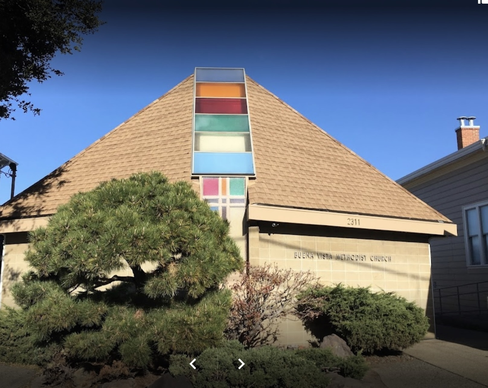

  

Every year, our church organizes a summer event known as the Bazaar, and it has become a tradition for everyone to participate in making it a success. The Bazaar serves as a fundraising initiative for the church, offering attendees the opportunity to purchase delicious food and engage in various entertaining games. The event is a collaborative effort where each individual has different roles to contribute to its overall success.During the previous summer, I had the privilege of taking on the responsibility of assisting with the games. My role involved not only facilitating the games but also explaining the rules and mechanics to the participants. It was a fulfilling experience to be actively involved in creating an enjoyable atmosphere for everyone attending the Bazaar, all while supporting the church's fundraising endeavors.
